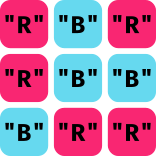

## Practice Exam 2a: Prob 1
You are tasked with identifying what is returned for every function call from the below code:
```{.mypython style="max-height:850px; font-size:.8em"}
def mystery(x):

    def puzzle(x, y=5):
        return x * y

    def enigma(y):
        return y ** x

    return enigma(puzzle(x=2)) + enigma(puzzle(3, x))

if __name__ == '__main__':
    print(mystery(3))
```

## 2a1: PythonTutor Trace 
<iframe width="1600" height="900" frameborder="0" src="https://pythontutor.com/iframe-embed.html#code=def%20mystery%28x%29%3A%0A%0A%20%20%20%20def%20puzzle%28x,%20y%3D5%29%3A%0A%20%20%20%20%20%20%20%20return%20x%20*%20y%0A%0A%20%20%20%20def%20enigma%28y%29%3A%0A%20%20%20%20%20%20%20%20return%20y%20**%20x%0A%0A%20%20%20%20return%20enigma%28puzzle%28x%3D2%29%29%20%2B%20enigma%28puzzle%283,%20x%29%29%0A%0Aif%20__name__%20%3D%3D%20'__main__'%3A%0A%20%20%20%20print%28mystery%283%29%29&codeDivHeight=400&codeDivWidth=350&cumulative=false&curInstr=0&heapPrimitives=false&origin=opt-frontend.js&py=311&rawInputLstJSON=%5B%5D&textReferences=false"> </iframe>

## Practice Exam 2a: Prob 2 {data-state="RedCrossTrace"}
::::::cols
::::col
Here you are tasked with:

- Creating a red cross GCompound of specified dimensions and crossing at the center
- Adding the cross to the middle of the window
- Having it move at a constant speed in a constant heading every 20 ms
- Implementing a listener to cause the constant heading to change when you click inside the cross
::::

::::col
<div id="RedCrossCanvas" class="CTCanvas"
     style="border:none; background-color:white; width:800px; height:800px;"></div>
::::
::::::

## 2a2: Possible Solution
```{.mypython style='max-height:850px; font-size:.7em;'}
from pgl import GWindow, GCompound, GRect
from random import uniform

WIDTH = 600
HEIGHT = 600

def create_cross():
    """ Creates the cross GCompound """
    c = GCompound()
    hrect = GRect(60, 20)
    hrect.set_filled(True)
    hrect.set_color("red")
    vrect = GRect(20, 60)
    vrect.set_filled(True)
    vrect.set_color("red")

    c.add(hrect, -30, -10)
    c.add(vrect, -10, -30)
    return c

def step():
    """ Animates the cross movement """
    cross.move_polar(2, gw.heading)

def click_action(event):
    """ Changes the heading if clicked within the cross """
    mx, my = event.get_x(), event.get_y()
    if cross.contains(mx, my):
        gw.heading = uniform(0, 360)


gw = GWindow(WIDTH, HEIGHT)
cross = create_cross()
gw.add(cross, WIDTH/2, HEIGHT/2)
gw.heading = uniform(0, 360)

gw.set_interval(step, 20)
gw.add_event_listener("mousedown", click_action) #click would be fine too
```

## Practice Exam 2a: Prob 3
::::::{.cols style='align-items: center'}
::::{.col style='font-size:.9em'}
- Here you are challenged to write two predicate functions dealing with a 2D array of strings
    - Ensuring that no two rows are identical to one another
    - Ensuring that, within a row, a single color does not repeat consecutively 3 or more times
- Both should return `True` if the puzzle is valid and these conditions are met, or `False` if there is a single instance of the condition being broken

::::

::::col



::::
::::::

## 2a3: No Duplicate Rows
One possible solution might look like:
```{.mypthon}
def no_duplicate_rows(puzzle):
    """ Checks that no two rows are exact duplicates of one 
    another. """
    for i in range(len(puzzle)):
        row = puzzle[i]
        if row in puzzle[i+1:]:
            return False
    return True
```

## 2a3: No Triple Repeats
There are many ways that this could be approached, but here I used a string to contain the consecutive sequences

```{.mypython style='max-height:850px; font-size:.8em;'}
def no_3petes_in_rows(puzzle):
    """ Checks that 3 blue or red squares never appear 
    adjacently in a row. """
    for row in puzzle:
        cons_str = "" #holds string of adj letters
        for letter in row:
            if cons_str == "" or letter == cons_str[-1]:
                cons_str += letter
            else:
                cons_str = letter
            if cons_str == "RRR" or cons_str == "BBB":
                return False
    return True
```

## Practice Exam 2b: Prob 1
You are again tasked with identifying what is returned for every function call from the below code:


```{.mypython style="max-height:850px; font-size:.8em"}
def puzzle(t):
    def mystery(r, x):
        x += 1
        def enigma(s=0):
            return r[s::x]
        return enigma
    x = 2
    y = mystery(t, x=x)
    return y(x) + y()

if __name__ == '__main__':
    print(puzzle("angriest"))
```

## 2b1: PythonTutor Trace
<iframe width="1600" height="900" frameborder="0" src="https://pythontutor.com/iframe-embed.html#code=def%20puzzle%28t%29%3A%0A%20%20%20%20def%20mystery%28r,%20x%29%3A%0A%20%20%20%20%20%20%20%20x%20%2B%3D%201%0A%20%20%20%20%20%20%20%20def%20enigma%28s%20%3D%200%29%3A%0A%20%20%20%20%20%20%20%20%20%20%20%20return%20r%5Bs%3A%3Ax%5D%0A%20%20%20%20%20%20%20%20return%20enigma%0A%20%20%20%20x%20%3D%202%0A%20%20%20%20y%20%3D%20mystery%28t,%20x%3Dx%29%0A%20%20%20%20return%20y%28x%29%20%2B%20y%28%29%0A%0Aif%20__name__%20%3D%3D%20'__main__'%3A%0A%20%20%20%20print%28puzzle%28%22angriest%22%29%29&codeDivHeight=400&codeDivWidth=350&cumulative=false&curInstr=0&heapPrimitives=nevernest&origin=opt-frontend.js&py=311&rawInputLstJSON=%5B%5D&textReferences=false"> </iframe>


## Practice Exam 2b: Prob 2 {data-state="SnakeTrace"}
::::::cols
::::col
- Here you are trying to recreate the movement of the basic game Snake
- No collision checking is necessary!!
- Clicking above or below a horizontally moving snake turns it that direction
- Clicking left or right a vertically moving snake turns it that direction
- Need to track three things: x and y position of head, and facing direction
::::

::::col
<div id="SnakeCanvas" class="CTCanvas"
     style="border:none; background-color:white; width:800px; height:800px;"></div>

::::
::::::


## 2b2: Snake Solution
```{.mypython style='max-height:850px; font-size:.8em;'}
from pgl import GWindow, GRect

SEG_WIDTH = 20
GW_WIDTH = 41 * SEG_WIDTH
GW_HEIGHT = 31 * SEG_WIDTH
DELTA_TIME = 150

def snake():
    """Runs a basic implementation of the game Snake"""

    def step():
        rect = GRect(
            gw.headx - SEG_WIDTH / 2, gw.heady - SEG_WIDTH / 2, 
            SEG_WIDTH, SEG_WIDTH
        )
        rect.set_filled(True)
        rect.set_fill_color("gray")
        gw.add(rect)
        if gw.snake_facing == "east":
            gw.headx += SEG_WIDTH
        elif gw.snake_facing == "west":
            gw.headx -= SEG_WIDTH
        elif gw.snake_facing == "north":
            gw.heady -= SEG_WIDTH
        elif gw.snake_facing == "south":
            gw.heady += SEG_WIDTH

    def down_action(event):
        mx, my = event.get_x(), event.get_y()
        if gw.snake_facing in ["north", "south"]:
            if mx > gw.headx:
                gw.snake_facing = "east"
            else:
                gw.snake_facing = "west"
        else:
            if my > gw.heady:
                gw.snake_facing = "south"
            else:
                gw.snake_facing = "north"

    gw = GWindow(GW_WIDTH, GW_HEIGHT)
    gw.headx, gw.heady = GW_WIDTH // 2, GW_HEIGHT // 2
    gw.snake_facing = "south"

    gw.set_interval(step, DELTA_TIME)
    gw.add_event_listener("mousedown", down_action)


if __name__ == "__main__":
    snake()
```

## Practice Exam 2b: Prob 3
- Here you want to write a function `rotate_array` which will shift all the elements of a list to the left or to the right by a specified amount
- `rotate_array(digits, 1)` should shift the elements one position to the left, and move the first value to the end
- `rotate_array(digits, -3)` should shift the elements three positions to the right, moving the last three elements back around to the beginning
- The elements should be shifted _in place_, not by creating a new list


## 2b3: Potential Solution
This is assuredly not the most compact solution, but I liked working out how to rotate the array by 1, and then just using a loop to repeat it the desired number of times:
```{.mypython style='max-height:650px; font-size:.8em;'}
def rotate_array(array, n):
    def roll_forward(array):
        tmp = array[0]
        for i in range(len(array)-1):
            array[i] = array[i+1]
        array[-1] = tmp

    def roll_backward(array):
        tmp = array[-1]
        for i in range(len(array)-1, 0, -1):
            array[i] = array[i - 1]
        array[0] = tmp

    for i in range(abs(n)):
        if n > 0:
            roll_forward(array)
        else:
            roll_backward(array)
```

<!--
## Dictionary Problem
- In Morse code, every letter is represented by a sequence of short pulses ("dots") or long pulses ("dashes") as shown in the following table:

{width=60%}

- The mapping from letters to Morse code is easy to represent as a Python dictionary in which the keys are the English letters and the values the corresponding string of dots and dashes, as shown on the next slide.


## A Python English to Morse Dictionary
```{.mypython style='max-height:900px; font-size:.8em'}
# File: MorseCodeDictionary.py

"""
This file defines a dictionary called LETTERS_TO_MORSE 
whose entries are the Morse code translations of the letters.
"""

# Constants 

LETTERS_TO_MORSE = {
   "A": ".-",
   "B": "-...",
   "C": "-.-.",
   "D": "-..",
   "E": ".",
   "F": "..-.",
   "G": "--.",
   "H": "....",
   "I": "..",
   "J": ".---",
   "K": "-.-",
   "L": ".-..",
   "M": "--",
   "N": "-.",
   "O": "---",
   "P": ".--.",
   "Q": "--.-",
   "R": ".-.",
   "S": "...",
   "T": "-",
   "U": "..-",
   "V": "...-",
   "W": ".--",
   "X": "-..-",
   "Y": "-.--",
   "Z": "--.."
}
```

## Your Mission
- In this problem, your job is to write a Python program that translates messages to Morse code.
- Your program should read in lines from the user and then translate each line into Morse code.
- Your program should continue prompting the user and translating until and empty line is entered
- A sample run of this program (taken from the messages between the Titanic and the Carpathia in 1912) might look like this:

  ```{.text style='font-size:.75em'}
  > SOS TITANIC
  ... --- ... - .. - .- -. .. -.-.
  > WE ARE SINKING FAST
  .-- . .- .-. . ... .. -. -.- .. -. --. ..-. .- ... -
  >
  ```

## `... --- .-.. ..- - .. --- -.`
```{.mypython style='max-height:900px; font-size:.75em;'}
# File: MorseCode.py

"""This program solves the MorseCode problem from section."""

from MorseCodeDictionary import LETTERS_TO_MORSE

def morse_code():
    """Translates lines to and from Morse code."""
    finished = False
    while not finished:
        line = input("> ")
        if line == "":
            finished = True;
        else:
            print(translate_letters_to_morse(line))

# Implementation note: translate_letters_to_morse
# -----------------------------------------------
# Translates a string of letters into Morse code characters separated
# by spaces.  Characters that don't appear in the table are ignored.

def translate_letters_to_morse(line):
    morse = ""
    for ch in line.upper():
        if ch in LETTERS_TO_MORSE:
            if morse != "":
                morse += " "
            morse += LETTERS_TO_MORSE[ch]
    return morse

# Startup code

if __name__ == "__main__":
    morse_code()
```
-->
